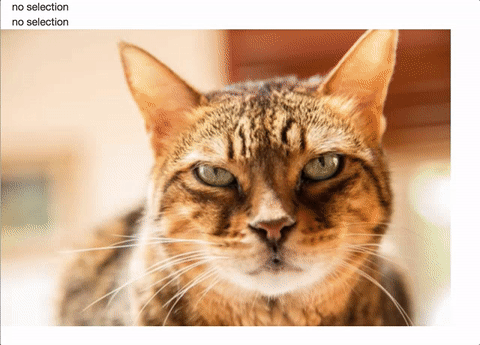

# purrple

## JcropImage

The `JcropImage` widget embeds cropping capabilities powered 
by the [Jcrop](http://deepliquid.com/content/Jcrop_Manual.html) javascript 
library. 

It is intended to be used in a shiny application. Here is a minimal example that displays
the coordinates on `change` and `select` events related to the `JcropImage` widget called `image` 

```r
library(shiny)
library(purrple)

ui = shinyUI(fluidPage(
  textOutput("change"), textOutput("select"), JcropImageOutput("image")
))

server = function(input, output, session) {

  output$image <- renderJcropImage(
    system.file( "cats", "cat2.jpg", package = "purrple" ),
    opacity = .3
  )

  selection <- function(data){
    if( is.null(data) ) {
      "no selection"
    } else {
      paste( names(data), " : ", data , sep = "", collapse = ", ")
    }
  }

  output$change <- renderText( selection(input$image_change))
  output$select <- renderText( selection(input$image_select))

}

shinyApp(ui = ui, server = server)
```

The first text output reacts to `_change` events, and is therefore updated often. 
The second text output reacts to `_select` events, so is only updated when the selection
stops moving. 

[]()

## JcropImage and JcropImagePreview

The `JcropImagePreview` works together with `JcropImage` to display a zoom preview of the 
selected part of the image. 

```r
library(shiny)
library(purrple)

ui = shinyUI(fluidPage(

  fluidRow(
    column(6, JcropImageOutput("image", height = 400 )),
    column(2, JcropImagePreviewOutput("preview", width = 400 ))
  )

))

server = function(input, output, session) {
  image <- system.file("cats", "cat3.jpg", package = "purrple")

  output$image <- renderJcropImage( image , opacity = .3, aspect_ratio = 1  )
  output$preview <- renderJcropImagePreview( JcropImagePreview("image", input$image_change) )

}

shinyApp(ui = ui, server = server)
```

The association between the two components is handled by the call to `JcropImagePreview`
function. Its first parameter is the id of the `JcropImageOutput` and the second 
parameter is the event generated, in this example we use the `_change` event to get 
fluid updates, but it might be useful to use the `_select` event instead to get 
fewer updates. 

[]()

## fluidImage

The `fluidImageOutput` widget is similar to the usual `imageOutput` but dynamically resizes. 

```r
library(shiny)
library(purrple)

ui = shinyUI(fluidPage(
  fluidRow(
    column(6, fluidImageOutput("cat1", height = 400) ),
    column(6, fluidImageOutput("cat2", height = 400) )
  ),
  fluidRow(
    column(6, fluidImageOutput("cat3", height = 400) ),
    column(6, fluidImageOutput("cat4", height = 400) )
  )
))

server = function(input, output, session) {

  get_cat <- function(i){
    system.file( "cats", sprintf("cat%d.jpg", i ), package = "purrple" )
  }
  output$cat1 <- renderFluidImage( get_cat(1) )
  output$cat2 <- renderFluidImage( get_cat(2) )
  output$cat3 <- renderFluidImage( get_cat(3) )
  output$cat4 <- renderFluidImage( get_cat(4) )

}

shinyApp(ui = ui, server = server)
```

[]()
